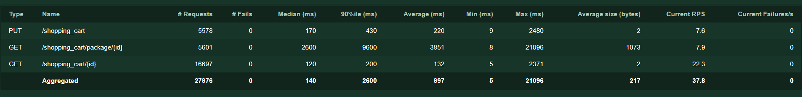
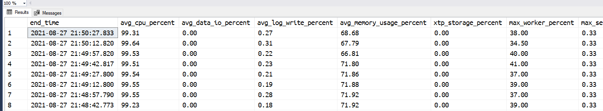

# Azure SQL Database Hyperscale Named Replicas OLTP Scale-Out Sample

This sample shows how you can use Azure SQL Database Hyperscale Named Replicas to easily scale-out an OLTP solution.

## Scenario

The code in the `./app` folder provide a REST endpoint that implements a basic shopping cart API. The REST endpoint has three methods:

- `GET /{id}`: return a JSON document containing a user shopping cart
- `GET /package/{id}`: return all the shopping carts that contains a package with the specified `id` value
- `PUT /`: store the received JSON document containing a user shopping cart

### Shopping Cart

The shopping cart is a JSON document, generated randomly, with this schema:

```json
{
    "cart_id": <cart_id>,
    "user_id": <user_id>,
    "items":[{
        "id": <item_id>,
        "quantity": <quantity>,
        "price": <price>,
        "details": {
            <random attributes>,
            "package": {    
                "id": <package_id>
            }
        }
    }]
}
```

The number of items is random and can be up to 10. The details of each item in the shopping cart are also randomly generated. The `package` object is also randomly added to some item.
Here's an example of a generated shopping cart JSON document:

```json
{
    "cart_id": 17,
    "user_id": 34851,
    "items": [,
         {
            "id": 5306,
            "quantity": 8,
            "price": 683.7700,
            "details": {
                "scyOQ": "kkJaPOdmwvQFvLEDNhXCACjBMRKOVwgvxoCHMqCORMRgZTLOkBLcRaq",
                "troG": "gSoTExi",
                "fVWdI": "zqCrSZUaPBMWxAALvAcnBHIXxesnQHIUOYkBWIpITfFLpJAlcZorPDRXZUihHRrSHuLjvGJKQWgUuMpZXr"
            }
        }        
        {
            "id": 7884,
            "quantity": 10,
            "price": 199.9600,
            "details": {
                "Mtjf": "EOgJjIlOkjWfEQpUePUwFyFxttnjKpZKwqCiYAwzCDnLyKLvfYOMpsFSprQdpwsSeCIbQYOOyaCUnu",
                "IJUybP": "jLdRhFzZuNkHDxmTQGovxAbtNQQNbSVdEBvsptWWjRihAsGzBRpCVJhvDkalCOwpwtyzEZRwdHzbRmBfzZmsMQYRzrPFY",
                "AiDiQ": "ZRCnVgq",
                "UdJSfHF": "uRGSVQcgVVpimfgLbfhOhIttoXsVdCdDBLPzfoBMYEuetJsPumtxzesBakwVvTWlMRpmVEHbTxCtuSzjTKdAlvY",
                "erUs": "pXDU",
                "tsssjH": "hESyhXmcfECkZ",
                "wHAGD": "QUbgrLxTXhbsClSgdBoTBlKbVcGGpW",
                "uJYQn": "HUNpGJWLnuUSZZBosldMqqWdeg",
                "package": {
                    "id": 3064
                }
            }
        }
    ]
}
```

### Database

Received JSON document is saved into the `dbo.shopping_cart` table. The well-know elements are saved into proper relational columns to have the best performance possible, while the item details, being completely dynamic, are stored as a JSON document.

The scripts to create the database and to create the required objects are available in the `./app/Database` folder. Make sure you create an Azure SQL Hyperscale database and the objects before deploying and running the Web App. Grab the connection string to the database as it will be needed in the next step.

## Deploy the app

Use the script `./app/azure-deploy.sh` to deploy the REST API in Azure. You can use WSL2 (script has been tested on WSL2 Ubuntu 20) or the Azure Cloud Shell.
The script needs and `.env` file to run correctly. It will create one the first time you run it, if it cannot find an existing one already. Make sure to fill out the values in the created `.env` file and then run the script again.

## Create some workload

To simulate a typical shopping cart activity, where new shopping cart are created and retrieved, the open source load testing tool [Locust](https://locust.io) is used. The test solution is available in the `./test` folder and the load test script is `./test/locust/locustfile.py`.

Locust can be run locally or via Docker. Even better, can be run directly on Azure via Azure Container Instances, to avoid any potential network or resource bottleneck that can be found when running on local environments.

To deploy and run Locust in Azure, use the `./test/azure-deploy.sh` script.

Once Locust has been deployed, create some workload by simulating 100 users with a spawn rate of 10 users per second, pointing to the url of the app you deployed in the previous step.

## Scalability Challenges

After a few seconds running Locust you'll notice that the average time needed to complete a GET or PUT request to the shopping cart is very high, above 100 msec. Also the GET request for `/shopping_cart/package/{id}`, which is a special search function that allows customer to find a certain item in their shopping cart is even higher, is well above the second.

Of course this is not something desirable, especially for the PUT method as, in this sample, would be the one used by users of our e-commerce site to put product in their shopping cart, and you really want that operation to be as fast as possible to avoid annoying customers with bad performance and having them [leaving your website](https://blog.hubspot.com/marketing/page-load-time-conversion-rates).



## Database Scale-Out

The problem might not be easy to understand, but from a very quick analysis it is evident that whatever code is being used by the `/shopping_cart/package/
{id}` REST endpoint, that is taking a lot of time. CPU time most probably, as it is also confirmed by running the following query

```sql
select * from sys.[dm_db_resource_stats]
```

on the database. In fact the database is used close to 100%:



while still impossible to exactly understand the problem, it seems evident that one of the issue could be cause byu the CPU being close to 100% of CPU usage. One option could be to try to scale-up the database service level (in the sample at just 2 vCores), but that is probably just going to kick the can a bit further, while we're looking for a more sound solution that would provide more performance stability.

We want to make sure that reads will be done on a different node than the one handling the writes, so that there can be non interference: even if some super complex query is run, it will not impact write performances as it will be running on a different node.

Scaling Out Azure SQL Hyperscale is easy: you can create up to 30 [Named Replicas](https://docs.microsoft.com/en-us/azure/azure-sql/database/service-tier-hyperscale-replicas?tabs=tsql#named-replica-in-preview) that you can use to handle read workloads.

Creating a new Named Replicas is very easy and happens in just an handful of seconds:

```sql
alter database <your-source-database>
add secondary on server <your-source-server>
with (secondary_type = Named, database_name = <replica-database-name>)
```

The provided sample application has been written so that it can direct read and write workloads to different servers. The `ScaleOut` class contains the code in charge of deciding to which database a request should be sent to. It asks the master database what are the available replicas by calling the stored procedure `api.get_available_scale_out_replicas` and it will send any read operation to one of the available named replicas, if any, otherwise will send the request to the  primary replica.

So, to inform that application that you have a new Named Replica available and that it can be used for this purpose, you just have to add a row in the `api.scale_out_replica` table:

```sql
insert into api.[scale_out_replica] 
    ([database_name], [enabled])
values 
    ('<replica-database-name>', 1)
```

Done. Now the application will send all read request to the newly created named replica, using the primary replica only for serving the write requests. 

More named replicas can be added just be repeating the same process, easily scaling-out the database.

## Conclusions

The sample shows how it is possible to architect an application to take advantage of several database replicas, by including in the code a simple - but smart - routing mechanism. By abstracting the access to the database to a base class (`ControllerQuery`) and an helper service (`ScaleOut`) the code is lean and clean and very easy to maintain and evolve.

## Improvements

The provided sample is very basic, and can be improved in several ways. For example, instead of just sending the write operations to the primary and the read operations to the named replicas, a bit more complex routing logic can be created. For example, it could be possible to route the request based on the workload type:

- simple GET request routed to named replicas 1 and 2
- complex GET request (search, reports, etc) to named replica

named replica 3 can be created with more CPU and memory in order to provide better performances to the complex reporting queries it has to handle, while named replicas 1 and 2 can be aligned to the primary replica (2vCore in the example) as they don't need a lot of CPU power.
