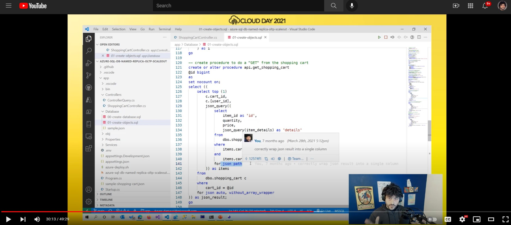
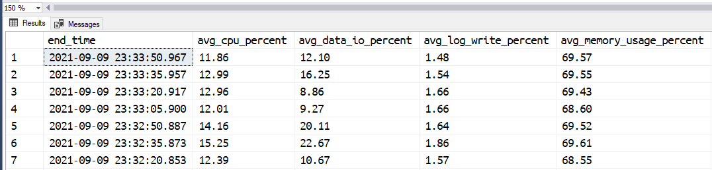
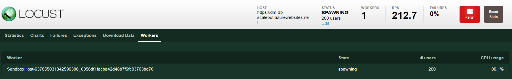

# Azure SQL Database Hyperscale Named Replicas OLTP Scale-Out Sample

<!-- 
Guidelines on README format: https://review.docs.microsoft.com/help/onboard/admin/samples/concepts/readme-template?branch=master

Guidance on onboarding samples to docs.microsoft.com/samples: https://review.docs.microsoft.com/help/onboard/admin/samples/process/onboarding?branch=master

Taxonomies for products and languages: https://review.docs.microsoft.com/new-hope/information-architecture/metadata/taxonomies?branch=master
-->


This sample shows how you can use Azure SQL Database Hyperscale Named Replicas to take advantage of ability to scale-out the database in an OLTP solution.

## Recording

Recording of a session dedicated to this example is available here: 



https://www.youtube.com/watch?v=VewaG1n1tbg

## Scenario

The code in the `./app` folder provide a REST endpoint that implements a basic shopping cart API. The REST endpoint has three methods:

- `GET /{id}`: return a JSON document containing a user shopping cart
- `GET /package/{id}`: return all the shopping carts that contains a package with the specified `id` value
- `PUT /`: store the received JSON document containing a user shopping cart

### Shopping Cart

The shopping cart is a JSON document, generated randomly, with this schema:

```json
{
    "cart_id": <cart_id>,
    "user_id": <user_id>,
    "items":[{
        "id": <item_id>,
        "quantity": <quantity>,
        "price": <price>,
        "details": {
            <random attributes>,
            "package": {    
                "id": <package_id>
            }
        }
    }]
}
```

The number of items is random and can be up to 10. The details of each item in the shopping cart are also randomly generated. The `package` object is also randomly added to some items. Here's an example of a generated shopping cart JSON document:

```json
{
    "cart_id": 17,
    "user_id": 34851,
    "items": [,
         {
            "id": 5306,
            "quantity": 8,
            "price": 683.7700,
            "details": {
                "scyOQ": "kkJaPOdmwvQFvLEDNhXCACjBMRKOVwgvxoCHMqCORMRgZTLOkBLcRaq",
                "troG": "gSoTExi",
                "fVWdI": "zqCrSZUaPBMWxAALvAcnBHIXxesnQHIUOYkBWIpITfFLpJAlcZorPDRXZUihHRrSHuLjvGJKQWgUuMpZXr"
            }
        }        
        {
            "id": 7884,
            "quantity": 10,
            "price": 199.9600,
            "details": {
                "Mtjf": "EOgJjIlOkjWfEQpUePUwFyFxttnjKpZKwqCiYAwzCDnLyKLvfYOMpsFSprQdpwsSeCIbQYOOyaCUnu",
                "IJUybP": "jLdRhFzZuNkHDxmTQGovxAbtNQQNbSVdEBvsptWWjRihAsGzBRpCVJhvDkalCOwpwtyzEZRwdHzbRmBfzZmsMQYRzrPFY",
                "AiDiQ": "ZRCnVgq",
                "UdJSfHF": "uRGSVQcgVVpimfgLbfhOhIttoXsVdCdDBLPzfoBMYEuetJsPumtxzesBakwVvTWlMRpmVEHbTxCtuSzjTKdAlvY",
                "erUs": "pXDU",
                "tsssjH": "hESyhXmcfECkZ",
                "wHAGD": "QUbgrLxTXhbsClSgdBoTBlKbVcGGpW",
                "uJYQn": "HUNpGJWLnuUSZZBosldMqqWdeg",
                "package": {
                    "id": 3064
                }
            }
        }
    ]
}
```

### Database

The received JSON document is saved into the `dbo.shopping_cart` table. The well-know elements are saved into proper relational columns to have the best performance possible, while the item details, being completely dynamic, are stored as a JSON document.

The scripts to create the database and to create the required objects are available in the `./app/Database` folder. Make sure you create an Azure SQL Hyperscale database and the objects before deploying and running the Web App. Grab the connection string to the database as it will be needed in the next step.

## Deploy the app

Use the script `./app/azure-deploy.sh` to deploy the REST API in Azure. You can use WSL2 (script has been tested on WSL2 Ubuntu 20) or the Azure Cloud Shell.
The script needs and `.env` file to run correctly. It will create one the first time you run it, if it cannot find an existing one already. Make sure to fill out the values in the created `.env` file and then run the script again.

## Create some workload

To simulate a typical shopping cart activity, where new shopping cart are created and retrieved, the open source load testing tool [Locust](https://locust.io) is used. The test solution is available in the `./test` folder and the load test script is `./test/locust/locustfile.py`.

Locust can be run locally or via Docker. Even better, can be run directly on Azure via Azure Container Instances, to avoid any potential network or resource bottleneck that can be found when running on local environments.

To deploy and run Locust in Azure, use the `./test/azure-deploy.sh` script.

Once Locust has been deployed, connect to the Locust master instance and create some workload by simulating 100 users with a spawn rate of 10 users per second, pointing to the url of the app you deployed in the previous step.

## Scalability Challenges

Performance are pretty good and steady at 100 request per seconds (RPS), if you are using the 100 user sample as suggested before.

### Simulating resource contention

To simulate what could happen if there is contention on some resources, which is something that could happen in case of very high concurrency, you can run the script in the `./test/sql/01-create-contention.sql`. The script will change the code of the stored procedure used by the GET and PUT verbs of the shopping cart API to artificially create an hot spot what will increase the execution time of each procedure to 10 msec. The changes will also decrease concurrency so that during that 10 msec of execution, no other procedure can access the same resources.

This will create the typical resource contention found on very busy systems, as the system resources are almost exhausted as they have to serve a huge number of request.

Now, even after running the script, you shouldn't notice any change in Locust performances. RPS will still be around 100. But try to increase the number of simulated users to 200. What you would expect on an healthy system, is that the RPS will grow proportionally, but this is not happening now, as we have created some artificial contention that prevent our system to scale to accomodate more users.

### Scaling Out

One option could be to try to scale-up the database service level (in the sample at just 2 vCores), but if the resource contention is due to a very heavily used resource - for example a table - increasing the CPU count or the memory size might not alway work. Another solution would be to use a "divide and conquer" approach. If we could have several copies of the same database, "magically" all kept in sync, we could have a solution like the following:

- One copy, the "primary" deals with all the writes and make sure all other copies are in sync
- "n" number of copies, the "secondary replicas" that will serve read-only queries  
- The application will use the primary or the secondary depending on the fact that it is managing a PUT or a GET request.

This scenario can be easily created using [Azure SQL Database Hyperscale named replicas](https://techcommunity.microsoft.com/t5/azure-sql/azure-sql-database-hyperscale-named-replicas-are-now-in-preview/ba-p/2451150).

You can create up to 30 named replicas, that you can use to handle read workloads. Creating a new Named Replicas is very easy and happens in just an handful of seconds:

```sql
alter database [<your-source-database>]
add secondary on server [<your-source-server>]
with (secondary_type = Named, database_name = [<replica-database-name>])
```

The provided sample application has been written so that it can direct read and write workloads to different servers. The `ScaleOut` class contains the code in charge of deciding to which database a request should be sent to. It asks to the primary replica what are the available replicas by calling the stored procedure `api.get_available_scale_out_replicas` and it will send any read operation to one of the available named replicas, if any, otherwise will send the request to the  primary replica.

So, to inform that application that you have a new Named Replica available and that it can be used for this purpose, you just have to add a row in the `api.scale_out_replica` table:

```sql
insert into api.[scale_out_replica] 
    ([database_name], [enabled])
values 
    ('<replica-database-name>', 1)
```

Add a couple of named replicas (like shown in script `01-add-named-replicas.sql`), so that the read workload will be shared across both and you're done. Now the application will send all read request to the newly created named replica, using the primary replica only for serving the write requests.

Once this is done, the RPS will go up to 200 RPS, as desired. 

## Conclusions

The sample shows how it is possible to architect an application to take advantage of several database replicas, by including in the code a simple - but smart - routing mechanism. By abstracting the access to the database to a base class (`ControllerQuery`) and an helper service (`ScaleOut`) the code is lean and clean and very easy to maintain and evolve.

### A note on costs

Named replicas are charged at the same amount of a database using the [Azure Hybrid Benefits](https://azure.microsoft.com/pricing/hybrid-benefit/), so you can expect quite a [substantial saving compared to regular databases](https://azure.microsoft.com/en-us/pricing/details/azure-sql-database/single/). As a result, architecting a solution to take advantage of scaling-out a database instead of scaling up, can help to have great performance at a lower overall TCO.

## Improvements

The provided sample is very basic, and can be improved in several ways. For example, instead of just sending the write operations to the primary and the read operations to the named replicas, a bit more complex routing logic can be created. For example, it could be possible to route the request based on the workload type:

- simple GET request routed to named replicas 1 and 2
- complex GET request (search, reports, etc) to another named replica (3)

named replica 3 can be created with more CPU and memory in order to provide better performances to the complex reporting queries it has to handle, while named replicas 1 and 2 can be aligned to the primary replica (2vCore in the example) as they don't need a lot of CPU power.

## Note one Azure SQL scalability

You may be wondering how much the Azure SQL HS_Gen5_2 you have used in the sample could have handled in terms of workload if the stored procedure wouldn't have had the artificial contention. Could it have handled 200 users? 500? 1000? Well, it turns out the Azure SQL can handle quite a lot of workload already...so much that you would have to create more clients and more backend API instances to throw to Azure SQL enough workload to start to show performance problems. When handling 200 concurrent user requests - without the artificial contention - Azure SQL was just using something around 10% of it CPU time:



while the Locust client was almost at 80% of its resources:



If you want learn more about this and see how a small 4 vCores database can serve up to 10K request per second, go here: [10K RPS REST API with Azure SQL, Dapper and JSON](https://dev.to/azure/10k-rps-rest-api-with-azure-sql-dapper-and-json-3me2)
